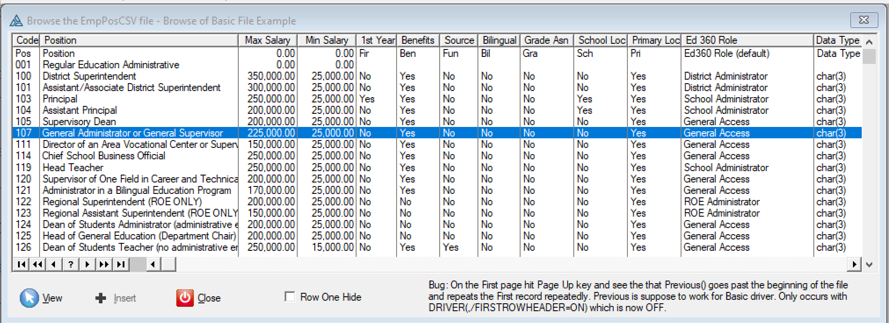
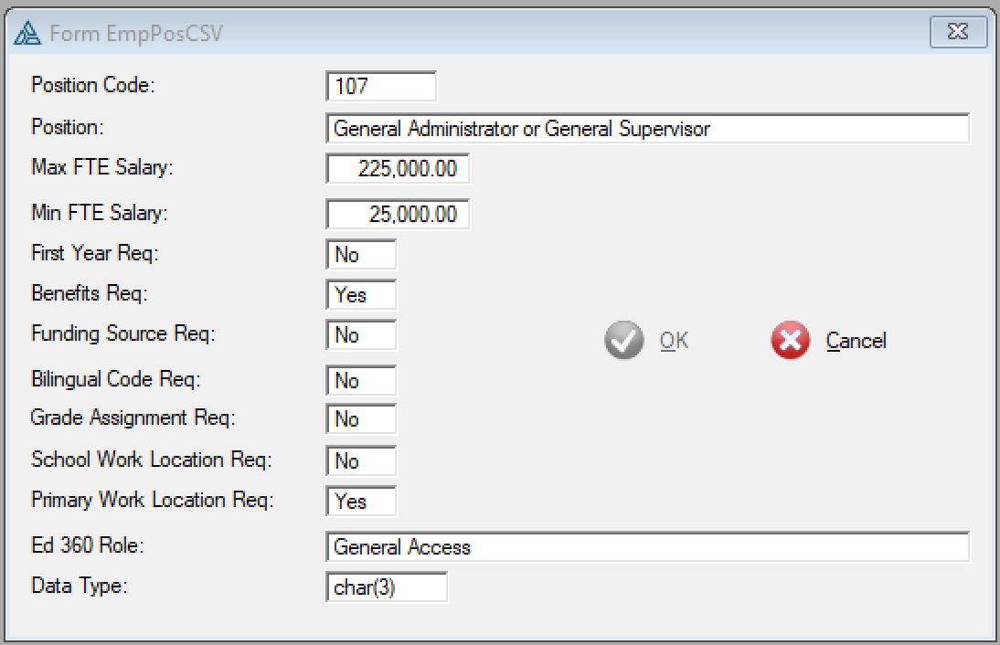
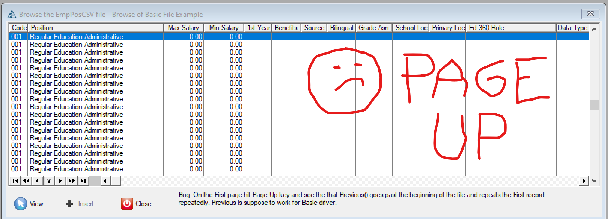

# Basic File Viewer Example

Adding the Basic file to your DCT has advantages. As shown below you can view the file in a Browse / Form. You can also have a Report or easily run it through a Process template.

Sometime in C9 or C10 the ASCII and BASIC drivers where changed so PREVIOUS would work. 
This allows a normal browse to view a BASIC file. 
So if you define your file in the DCT and you can wizard a Browse and Form to view the data.

The Form has to be changed to NOT allow Change or Delete and on the Browse delete those buttons. 
You probably do not want to allow Insert either on the Form. On the Browse disable and hide the Insert button.

The wizarded Browse has a View button but the Form does not have the Extension template "Configure View Only Form Mode". To support View so you must to add that.

The BASIC driver has a bug with PREVIOUS if you specify the /FIRSTROWHEADER=ON that it will not return an error so will return the second record forever (screen cap below). You can work around this by removing the Driver string andimplement it in code as you see in the attached example the checkbox on the Browse.

The example has a Process procedure that explains that RecordsPerCycle should be adjusted to 25 * Average Record Size in bytes. A Message allows selecting between the default of 1000 bytes and 25*100=2500 bytes that runs faster.

Browse of Basic file example. 

Form showing Basic file line.

With /FIRSTROWHEADER=ON pressing Page Up will show the first record repeatedly.

