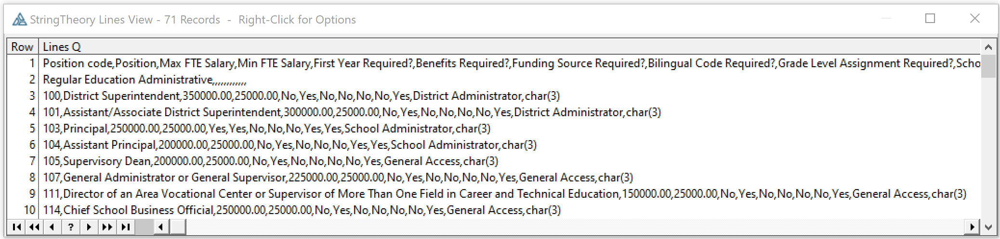
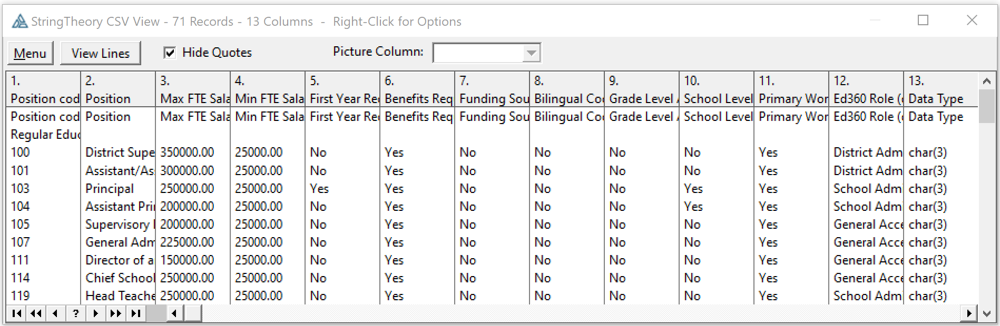
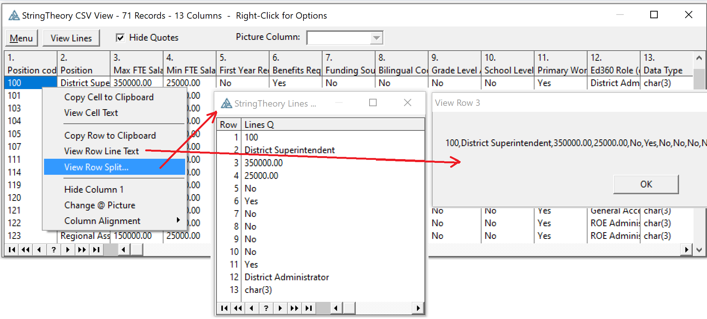
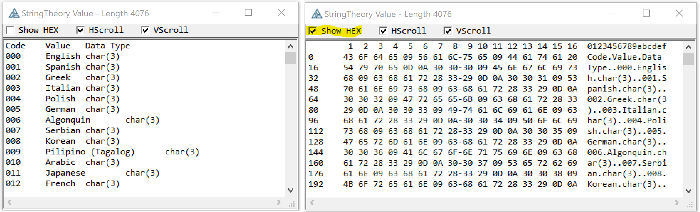
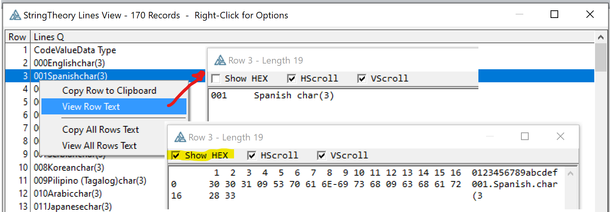
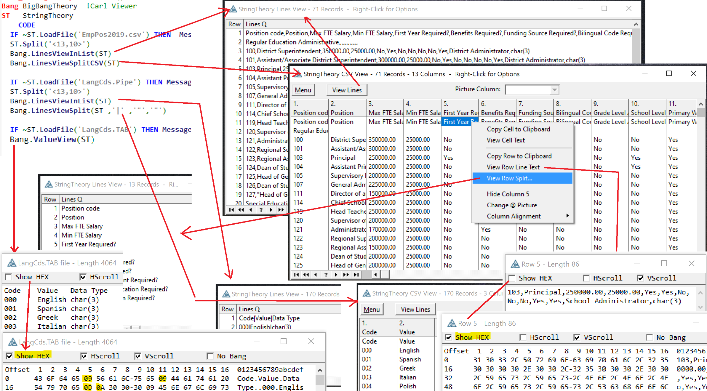

# StringTheory-LoadFile-Split-Viewer
 StringTheory LoadFile and Split Viewer aka BigBangTheory

StringTheory makes it easy to load a CSV file and split it into columns. 
This class helps by allowing you to view the file right from the StringTheory object to confirm the data is what you exect, and to see how the splits are working.

You write code like below (from https://www.capesoft.com/docs/StringTheory3/StringTheory.htm#ParsingCSVFile).
```Clarion
str   StringTheory
lne   StringTheory
x     Long
  code
  str.LoadFile('Somefile.CSV')
  str.Split('<13,10>','"')
  loop x = 1 to str.Records()
    Lne.SetValue(Str.GetLine(x))
    Lne.Split(',','"','"',true)
    field1 = Lne.GetLine(1)
    field2 = Lne.GetLine(2)
  End
```

Insert BigBang calls to view the results of various Splits in a LIST.

```Clarion
str   StringTheory
lne   StringTheory
x     Long
Bang BigBangTheory    !<-- Viewer
  code
  str.LoadFile('Somefile.CSV')
  str.Split('<13,10>','"')
  IF DebugLoad THEN               !<-- Limit to just developers
     Bang.LinesViewInList(str)    !<-- Add to see Lines split by 13,10
     Bang.LinesViewSplitCSV(Str)  !<-- Add to see CSV columns
     Bang.LinesViewSplit(Str,',','"','"')  !Alternate specify Split() parms
  END
  loop x = 1 to str.Records()
    Lne.SetValue(Str.GetLine(x))
    Lne.Split(',','"','"',true)
    IF X=5 AND DebugLoad THEN     !<-- Limit to developers and line 5
       Bang.LinesViewInList(Lne)  !<-- See Lines from your: Lne.Split(',','"','"',true)
    END
    field1 = Lne.GetLine(1)
    field2 = Lne.GetLine(2)
  End
```

Call ```Bang.LinesViewInList(str)``` to view a LIST with the result of the ```ST.Split('<13,10>','"')``` to lines:



Typical code loops the 13,10 split lines to split each line using CSV or Tabs. 
You can see the entire file split this way in a LIST with a calling ```Bang.LinesViewSplit(Str,',','"','"')``` or for CSV call ```Bang.LinesViewSplitCSV(Str)```. 



In that list you can right click on a row and view the columns as rows in a LIST. You can also see then entire line or copy it to the clipboard.




```Clarion
  loop x = 1 to str.Records()
    Lne.SetValue(Str.GetLine(x))
    Lne.Split(',','"','"',true)
    IF X=5 AND DebugLoad THEN     !<-- Limit to developers and line 5
       Bang.LinesViewInList(Lne)  !<-- See Lines from your: Lne.Split(',','"','"',true)
    END
    field1 = Lne.GetLine(1)
    field2 = Lne.GetLine(2)
  End
```

If there is a loop splittng lines (like above) you can call ```Bang.LinesViewInList(Lne)``` to view one line to be certain your Split() call is working as you expect.


To view the current value in the StringTheory object call ```Bang.ValueView(ST) ``` or you can view any string with ```Bang.StringView(Cus:Record)```. The viewer can be changed to show Hex so you can see the low ASCII values like Tab Chr(9).



All right click popups have been changed to use this string viewer instead of a message.



Screen capture shows several views available based on included Bang Test example CwProj and files.



I would expect you might use this class in your APP to allow a quick way to view files before import. You probably will want to remove some of the features that would confuse end users, like the Picture thing and Menu.

There is also a SystemStringClass version. That class has no ability to deal with CSV type quoted values.

