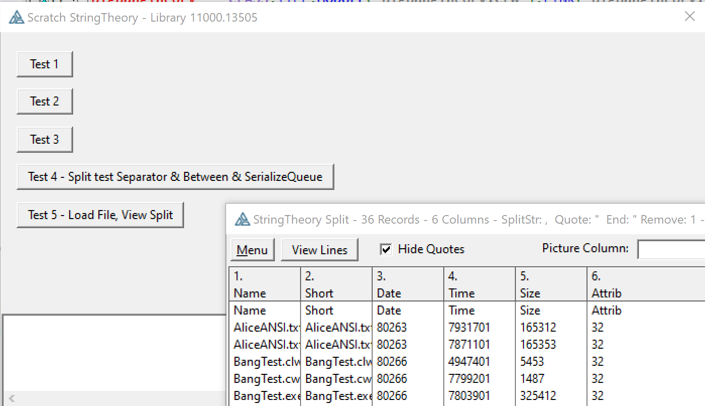

# StringTheory-LoadFile-Split-Viewer
 StringTheory LoadFile and Split Viewer aka BigBangTheory

StringTheory makes it easy to load a CSV file and split it into columns.
This class helps by allowing you to view the file right from the StringTheory object to confirm the data is what you exect, and to see how the splits are working.

You write code like below (from https://www.capesoft.com/docs/StringTheory3/StringTheory.htm#ParsingCSVFile).
```Clarion
str   StringTheory
lne   StringTheory
x     Long
  code
  str.LoadFile('Somefile.CSV')
  str.Split('<13,10>','"')
  loop x = 1 to str.Records()
    Lne.SetValue(Str.GetLine(x))
    Lne.Split(',','"','"',true)
    field1 = Lne.GetLine(1)
    field2 = Lne.GetLine(2)
  End
```

Insert BigBang calls to view the results of various Splits in a LIST.

```Clarion
str   StringTheory
lne   StringTheory
x     Long
Bang BigBangTheory    !<-- Viewer
  code
  str.LoadFile('Somefile.CSV')
  str.Split('<13,10>','"')
  IF DebugLoad THEN               !<-- Limit to just developers
     Bang.LinesViewInList(str)    !<-- Add to see Lines split by 13,10
     Bang.LinesViewSplitCSV(Str)  !<-- Add to see CSV columns
     Bang.LinesViewSplit(Str,',','"','"')  !Alternate specify Split() parms
  END
  loop x = 1 to str.Records()
    Lne.SetValue(Str.GetLine(x))
    Lne.Split(',','"','"',true)
    IF X=5 AND DebugLoad THEN     !<-- Limit to developers and line 5
       Bang.LinesViewInList(Lne)  !<-- See Lines from your: Lne.Split(',','"','"',true)
    END
    field1 = Lne.GetLine(1)
    field2 = Lne.GetLine(2)
  End
```

Call ```Bang.LinesViewInList(str)``` to view a LIST with the result of the ```ST.Split('<13,10>','"')``` to lines:


Typical code loops the 13,10 split lines to split each line using CSV or Tabs.
You can see the entire file split this way in a LIST with a calling ```Bang.LinesViewSplit(Str,',','"','"')``` or for CSV call ```Bang.LinesViewSplitCSV(Str)```.


In that list you can right click on a row and view the columns as rows in a LIST. You can also see then entire line or copy it to the clipboard.


```Clarion
  loop x = 1 to str.Records()
    Lne.SetValue(Str.GetLine(x))
    Lne.Split(',','"','"',true)
    IF X=5 AND DebugLoad THEN     !<-- Limit to developers and line 5
       Bang.LinesViewInList(Lne)  !<-- See Lines from your: Lne.Split(',','"','"',true)
    END
    field1 = Lne.GetLine(1)
    field2 = Lne.GetLine(2)
  End
```

If there is a loop splittng lines (like above) you can call ```Bang.LinesViewInList(Lne)``` to view one line to be certain your Split() call is working as you expect.


To view the current value in the StringTheory object call ```Bang.ValueView(ST) ``` or you can view any string with ```Bang.StringView(Cus:Record)```. The viewer can be changed to show Hex so you can see the low ASCII values like Tab Chr(9).


All right click popups have been changed to use this string viewer instead of a message.


Screen capture shows several views available based on included Bang Test example CwProj and files.


I would expect you might use this class in your APP to allow a quick way to view files before import. You probably will want to remove some of the features that would confuse end users, like the Picture thing and Menu.

There is also a SystemStringClass version. That class has no ability to deal with CSV type quoted values.


Check out the BasicFileBrowse subfolder with an example of using a BASIC file defined in the DCT and discussion of some advantages.
https://github.com/CarlTBarnes/StringTheory-LoadFile-Split-Viewer/tree/master/BasicFileBrowse


## BigBangTheory.INC

The BigBangTheory Class has just a few methods to let you see either the StringTheory Value or the Lines.
 StringView allows viewing any String. WrapView allow viewing the word wrapping

```Clarion
BigBangTheory  CLASS,TYPE,MODULE('BigBangTheory.CLW'),LINK('BigBangTheory.CLW')
DoNotShow         BOOL  !=True doesn't show any BBT Windows, Class is for Developers

ValueView         PROCEDURE(StringTheory STtoViewGetValue, <STRING WindowCaption>)
StringView        PROCEDURE(STRING  StrValue, <STRING WindowCaption>) 

WrapView          PROCEDURE(StringTheory STforWrap, <STRING WindowCaption>, Bool pOpenWrapped=false)

LinesViewInList   PROCEDURE(StringTheory STwithLinesSplitDone, <STRING WindowCaption>)

LinesViewSplitCSV PROCEDURE(StringTheory STwithLinesSplitDone, BYTE RemoveQuotes=False)  
LinesViewSplitTAB PROCEDURE(StringTheory STwithLinesSplitDone)  
LinesViewSplit    PROCEDURE(StringTheory STwithLinesSplitDone, STRING SplitDelim, <STRING QuoteStart>,<STRING QuoteEnd>, BYTE RemoveQuotes=TRUE)  
```


## Scratch Theory

The best way to learn how to use StringTheory is to actually write code to call the library, build, run
 and see the results. Many times this involves pasting example code and modifying it for your needs.

Included in this Repo is the ScratchTheory Project. A "Scratch Program" is a small source template ready
 to add code snippets, build, run and test.
 This saves reproducing all the boring parts (includes, defines, window, accept) of the program just to try a little piece of code and see the results.
 One thing that makes Scratch programming faster is the very small size letting it build fast.
 
If you need to use the debugger it's much faster with a tiny scratch program to step and set break-points.
 If you are trying figure out how StringTheory works, what methods are being called, it can be tedious to trace through
 the code in the editor. Sometimes it's easier to step through it in the debugger and see each line execute plus
 be able to see the values of the variables.

ScratchTheory has StringTheory included, defined and ready to use. It also has BingBangTheory to see StringTheory Values or Lines.
 It has a DB() procedure to OutputDebugString. It has a Window with a Text Control. You can have your code written and tested in a few minutes.

An example included in the Scratch program is the below routine run by button 4 that
 Serializes a Queue loaded by Directory() then splits that by 13,10 into lines.
 The BigBangTheory class is used to view the resulting string or lines inside the StringTheory object:

```Clarion
Test4Rtn ROUTINE
    DATA
Bang    BigBangTheory
ST      StringTheory
FilesQ  FILE:Queue
    CODE
    DIRECTORY(FilesQ,'*.*',ff_:NORMAL)
    st.SerializeQueue(FilesQ,'<13,10>',',','"')
    st.Prepend('Name,Short,Date,Time,Size,Attrib<13,10>')
       bang.ValueView(ST,'Directory SerializeQueue Value')
    st.Split('<13,10>')
       bang.LinesViewInList(ST,'Directory SerializeQueue Lines')
       bang.LinesViewSplitCSV(ST)
       EXIT
```


